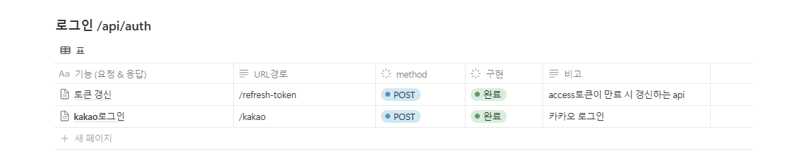
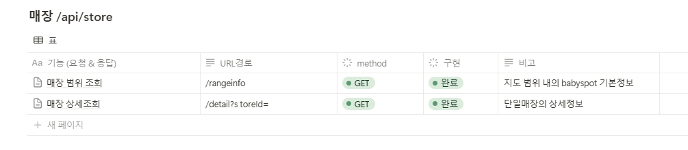
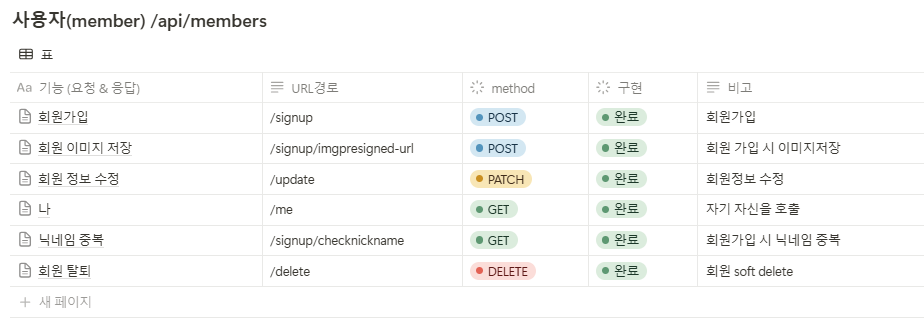
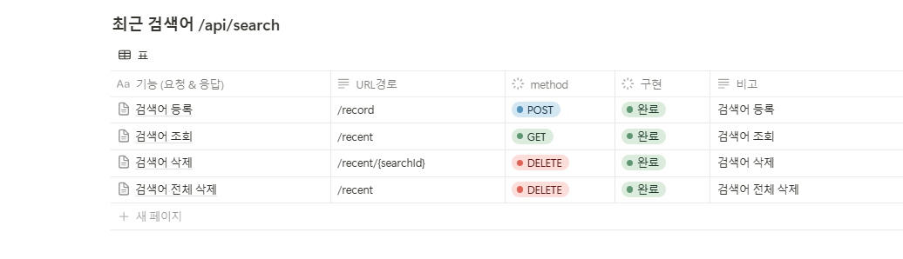
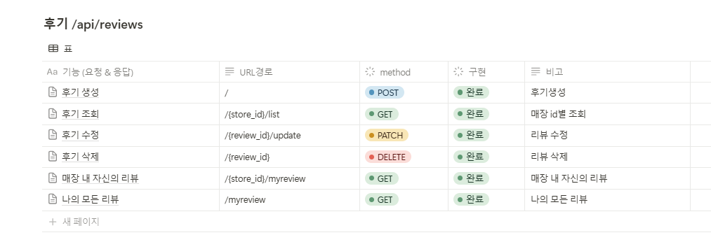

## 서비스명 및 개요

# Baby Spot

**서울시 영유아 친화 가게 추천 서비스**

## 주요 문제 해결

### **1)** 아이 동반 고객을 위한 **편의 용품/서비스 정보 부족**

- 현재 음식점 정보에는 **유아용 의자, 놀이 공간, 키즈 메뉴 여부 등 필수 정보 부족**
- 부모들이 원하는 **유아 친화적인 음식점을 찾는 것이 어려움**

### **2)** 아이와 함께 외식 시, **적절한 장소 정보를 찾기 어려움**

- 일반적인 지도 앱(네이버, 구글)에서는 **가족 친화적인 장소를 필터링하기 어려움**
- **실제 방문자 리뷰 기반의 신뢰도 높은 데이터 부족**

#💡주요 기능

### **1. 사용자 위치 기반 매장조회**

- **GPS 기반 현재 위치 주변 추천**
- **서울시 오케이존 데이터 활용하여 유아 친화 가게 필터링**

### **2. 위치 검색 조회**

- **원하는 위치에서 유하 친화 가게 조회 가능능**

### **3. 사용자 기반 추천**

- **사용자가 입력한 아이의 정보에 따라 매장을 추천천**

# 🔗 API 명세

### 로그인 /api/auth
{width=768 height=82}

### 매장 /api/store
{width=768 height=69}

### 사용자(member) /api/members
{width=768 height=134}

### 추천 /api/recommend
{width=770 height=27}

### 후기 /api/store/{storeId}/reviews
{width=771 height=159}

# 아키텍쳐

# ERD

# 🛠️ 기술스택

## 일정 계획 (7주: 2.24 ~ 4.11)

- **1주~2주**: 아이디어 선정 및 기획
- **3주**: 요구 사항 정의 및 기획 완료
- **4~5주**: 기본적인 개발
- **6주**: 디버깅 및 고도화
- **7주**: 배포 및 발표

## 🥌 마일스톤

| 기한 | 마일스톤 | 설명 |
| --- | --- | --- |
| 2025.03.10. | 협업 규칙 및 툴 정리 | 그라운드 룰, 컨벤션 등의 팀 내 규칙 및 사용 툴 정리. |
| 2025.03.11. | 프로젝트 기획 수립 | 기획 아이디어 도출 및 최종 기획 확정. 팀 내 기획 구상 확립. |
| 2025..03.14. | 와이어프레임 및 유스케이스 구축 | 사용자 입장에서의 서비스 로직 구상 및 팀 내 의견 통일. 데이터 의사 결정. |
| 2025.03.17. | 화면 디자인 | 와이어프레임을 통한 디자인 도출. |
| 2025.03.18. | ERD 및 CI/CD, 폴더 구축 등 프로젝트 세팅 | 서비스 개발을 위한 프로젝트 초기 세팅. |
| 2025.03.21. | 중간 발표 준비 및 자료 정리 | 중간 발표를 위한 팀 내 의사 결정, 발표 준비 및 자료 정리. |
| 2025.03.24. | 프로젝트 1차 기능 개발 마감 및 배포 | 필수 MVP 기능을 도입한 서비스 개발 및 배포. |
| 2025.04.04. | 프로젝트 2차 기능 개발 마감 및 배포 | 추가 기능 및 1차에서 피드백한 기능 개발, 배포. |
| 2025.04.09. | 서비스 문서 정리 마감 | 최종 서비스 문서화 및 정리. |
| 2025.04.11. | 프로젝트 최종 기능 개발 마감 및 배포 | 추가 기능 및 2차에서 피드백한 기능 개발, 배포. |
| 2025.04.11. | 최종 발표 준비 및 자료 정리 | 최종 발표를 위한 팀 내 의사 결정, 발표 준비 및 자료 정리. |

## 개발 팀 소개

<table>
  <tr align="center" valign="top">
    <td>
       
      <b>이상화</b> 
      (Back-end)
    </td>
    <td>
       
      <b>김지승</b> 
      (Infra)
    </td>
    <td>
       
      <b>김현우</b> 
      (Data)
    </td>
    <td>
       
      <b>상한규</b> 
      (Front-end)
    </td>
    <td>
       
      <b>소남주</b> 
      (Front-end)
    </td>
    <td>
       
      <b>한병현</b> 
      (Front-end)
    </td>
  </tr>
</table>

