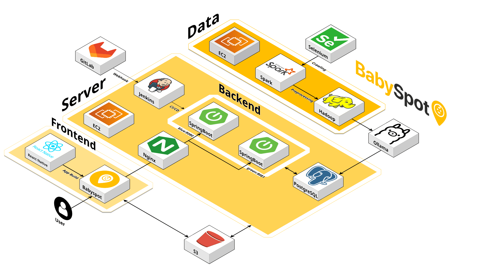

<div align="center">
  
</div>

### 사용 도구

- 이슈 관리 : Jira
- 형상 관리 : GitLab
- 커뮤니케이션 : Notion, MatterMost
- 디자인 : Figma
- 빌드 도구 : Jenkins

### 개발 도구

- Visual Studio Code : ver 1.97.2
- IntelliJ IDEA Ultimate : 2024.3.2
- Pycharm : 2024.3.2
- DataGrip : 2024.3.3

### 외부 서비스

- KaKao : 카카오 Oauth2.0 로그인 및 장소 키워드 API 이용
- Naver : API 네이버 지도 API 이용

### 배포 대상 (Targets)

| 항목                   | 값                    |
| ---------------------- | --------------------- |
| Android 최소 지원 버전 | API 24 (Android 7.0)  |
| Android 타겟 버전      | API 35 (Android 15.0) |

### 개발 환경

**Server**

| 항목 |
| ------- |
| AWS S3  |
| AWS EC2 #1(server) |
| AWS EC2 #2(hadoop) |

**Frontend**
| 항목 | 버전 |
| ------- | --------------- |
| React | 19.0.0 |
| React Native | 0.78.1 |
| Node | 22.13.1 |

<details>
<summary><strong>그 외 라이브러리</strong></summary>

| 라이브러리                        | 설명                         | 버전    |
| --------------------------------- | ---------------------------- | ------- |
| styled-components                 | 스타일 컴포넌트 기반 UI 구성 | 6.1.16  |
| zustand                           | 전역 상태 관리               | 5.0.3   |
| axios                             | API 통신                     | 1.8.4   |
| @react-navigation/native          | 네비게이션 루트              | 7.0.17  |
| @react-navigation/native-stack    | Stack 네비게이션             | 7.3.1   |
| @react-navigation/bottom-tabs     | 탭 네비게이션                | 7.3.2   |
| @gorhom/bottom-sheet              | 커스텀 바텀시트 UI           | 5.1.2   |
| @react-native-picker/picker       | 셀렉트 박스                  | 2.11.0  |
| react-native-image-picker         | 이미지 업로드                | 8.2.0   |
| react-native-webview              | 웹뷰 렌더링                  | 13.13.5 |
| react-native-config               | 환경변수 관리                | 1.5.5   |
| react-native-encrypted-storage    | 민감 정보 암호화 저장        | 4.0.3   |
| react-native-device-info          | 디바이스 정보 조회           | 14.0.4  |
| @mj-studio/react-native-naver-map | 네이버 지도 연동             | 2.3.0   |
| @react-native-seoul/kakao-login   | 카카오 로그인                | 5.4.1   |
| react-native-vector-icons         | 아이콘 사용                  | 10.2.0  |
| react-native-reanimated           | 제스처/애니메이션            | 3.17.1  |
| react-native-safe-area-context    | Safe Area 처리               | 5.3.0   |

</details>
<br/>

**Backend**

| 항목 | 버전 |
| ------- | --------------- |
| Java           | Eclipse Temurin 17.0.14       |
| Spring Boot    | 3.4.3                         |
| Python         | 3.12.8                        |
| Python library | requirements.txt 참조         |
| Redis          | 7.4.2                         |
| PostgreSQL     | PostgreSQL 17.4               |

**Data**
| 항목 | 버전 |
| ------- | --------------- |
| Hadoop  | 3.3.6           |
| Spark   | 3.4.4           |

**LLM**
| 항목 | 버전 |
| ------- | --------------- |
| ollama  | 0.6.2           |
| model   | qwen2.5:32b     |

**Infra**

| 항목 | 버전 |
| ------- | --------------- |
| Docker  | 26.1.3      |
| Docker Compose  | 2.24.5      |
| Ubuntu  | 22.04.5 LTS |
| Jenkins | 2.492.2     |

### 포트

**백엔드 서비스 포트**

| 서비스 | 포트 |
| ------- | --------------- |
| Blue | 8080 |
| Green | 8081 |
| Test | 8082 |
| Jenkins | 9090 |


**하둡 서비스 포트**

| 서비스 | 포트 |
| ------- | --------------- |
| HDFS NameNode | 9000 |
| NameNode WebUI | 9870 |
| HDFS DataNode | 9866 |
| DataNode WebUI | 10200 |


### 환경 변수

backend.env (중요 정보 생략)

```yaml
JWT_SECRET=
ACCESS_TOKEN_EXPIRATION=
REFRESH_TOKEN_EXPIRATION=
TEMP_TOKEN_EXPIRATION=

POSTGRES_URL=
POSTGRES_USER=
POSTGRES_PASSWORD=

KAKAO_CLIENT_ID=
KAKAO_CLIENT_SECRET=
KAKAO_REDIRECT_URI=

AWS_ACCESS_KEY_ID=
AWS_SECRET_ACCESS_KEY=
AWS_REGION=

BASE_URL=

CLOUDFRONT_URL=

REDIS_HOST=
REDIS_PORT=
```

frontend.env

```yaml
NAVER_CLIENT_ID=

# Kakao Key
KAKAO_NATIVE_APP_KEY=
KAKAO_REST_API_KEY=

# Relase KeyStore
RELEASE_KEYSTORE_PATH=
RELEASE_KEYSTORE_ALIAS=
RELEASE_KEYSTORE_PASSWORD=
RELEASE_KEY_PASSWORD=

# Base URL
BASE_URL_DEBUG=
BASE_URL_RELEASE=

# Cloud Front Prefix
CLOUDFRONT_PREFIX=
```

### Front-End 어플리케이션 빌드 및 APK 추출

1.  `.env`, `.debug-keystore`, `.baby-spot-release.keystore`을 프로젝트에 추가.
2.  다음 명령어를 통해 `node_modules` 파일 생성 및 업데이트
    ```
    yarn
    ```
3.  번들 생성

    3-1. debug 번들 생성

    - debug 번들 생성 시 아래 명령어 수행
      ```
      npx react-native bundle \
      --platform android \
      --dev true \
      --entry-file index.js \
      --bundle-output android/app/src/main/assets/index.android.bundle \
      --assets-dest android/app/src/main/res
      ```
    - `android/` 경로에서 아래 명령어 수행으로 빌드 파일 생성
      ```
      ./gradlew assembleDebug
      ```
    - `android/app/build/outputs/apk` 경로에서 빌드된 apk 확인

    3-2. release 번들 생성

    - release 번들 생성 시 아래 명령어 수행
      ```
      npx react-native bundle \
      --platform android \
      --dev false \
      --entry-file index.js \
      --bundle-output android/app/src/main/assets/index.android.bundle \
      --assets-dest android/app/src/main/res
      ```
    - `android/` 경로에서 아래 명령어 수행으로 빌드 파일 생성
      ```
      ./gradlew app:assembleRelease
      ```
    - `android/app/build/outputs/apk` 경로에서 빌드된 apk 확인

### CI/CD

**jenkins**


**credentials 설정**

- GitLab Token 등록
- Docker hub 로그인 정보 등록
- Docker image push를 위한 repo 정보 등록
- SSH 접속을 위해 EC2 IP 정보와 .pem키 정보 등록
- .env 파일 등록

**backend pipeline (production)**

```bash
pipeline {
    agent any
    
    environment {
        DOCKER_REGISTRY = 'kimsz123456'
        BACKEND_IMAGE = 'babyspot-backend'
    }
    
    stages {
        stage('Checkout') {
            steps {
                git branch: 'master', 
                    credentialsId: 'gitlab-git-credential', 
                    url: 'https://lab.ssafy.com/s12-bigdata-dist-sub1/S12P21A607'
            }
        }
        
        stage('Setup Environment') {
            steps {
                withCredentials([file(credentialsId: 'backend-env-file', variable: 'ENV_FILE')]) {
                    sh '''
                        cp $ENV_FILE backend/.env
                        chmod 644 backend/.env
                    '''
                }
            }
        }
        
        stage('Docker Login') {
            steps {
                withCredentials([usernamePassword(credentialsId: 'docker-hub-credentials', passwordVariable: 'DOCKERHUB_PSW', usernameVariable: 'DOCKERHUB_USR')]) {
                    sh 'echo $DOCKERHUB_PSW | docker login -u $DOCKERHUB_USR --password-stdin'
                }
            }
        }
        
        stage('Build Backend') {
            steps {
                sh '''
                    chmod +x backend/gradlew
                    cd backend && ./gradlew clean build -x test
                '''
            }
        }
        
        stage('Build Backend Docker Image') {
            steps {
                sh """
                    cd backend
                    docker build -t ${DOCKER_REGISTRY}/${BACKEND_IMAGE}:${BUILD_NUMBER} .
                    docker tag ${DOCKER_REGISTRY}/${BACKEND_IMAGE}:${BUILD_NUMBER} ${DOCKER_REGISTRY}/${BACKEND_IMAGE}:latest
                """
            }
        }
        
        stage('Push Docker Images') {
            steps {
                sh """
                    docker push ${DOCKER_REGISTRY}/${BACKEND_IMAGE}:${BUILD_NUMBER}
                    docker push ${DOCKER_REGISTRY}/${BACKEND_IMAGE}:latest
                """
            }
        }
        
        stage('Deploy') {
            steps {
                withCredentials([
                    sshUserPrivateKey(credentialsId: 'ec2-ssh-key', keyFileVariable: 'SSH_KEY')
                ]) {
                    sh """
                        # .env 파일을 EC2로 복사
                        scp -i \${SSH_KEY} -o StrictHostKeyChecking=no backend/.env ubuntu@<EC2_IP>:/home/ubuntu/babyspot/
                        
                        # EC2에서 배포 스크립트 실행
                        ssh -i \${SSH_KEY} -o StrictHostKeyChecking=no ubuntu@<EC2_IP> "\
                        cd /home/ubuntu/babyspot && \
                        bash deploy.sh"
                    """
                }
            }
        }
    }
    post {
        always {
            sh 'docker logout'
            cleanWs()
        }
    }
}
```

**backend pipeline(test)**

```bash
pipeline {
    agent any
    
    environment {
        DOCKER_REGISTRY = 'kimsz123456'
        BACKEND_TEST_IMAGE = 'babyspot-backend-test'
    }
    
    stages {
        stage('Checkout') {
            steps {
                git branch: 'back-end-master', 
                    credentialsId: 'gitlab-git-credential', 
                    url: 'https://lab.ssafy.com/s12-bigdata-dist-sub1/S12P21A607'
            }
        }
        
        stage('Setup Environment') {
            steps {
                withCredentials([file(credentialsId: 'test-backend-env-file', variable: 'ENV_FILE')]) {
                    sh '''
                        cp $ENV_FILE backend/.env
                        chmod 644 backend/.env
                    '''
                }
            }
        }
        
        stage('Docker Login') {
            steps {
                withCredentials([usernamePassword(credentialsId: 'docker-hub-credentials', passwordVariable: 'DOCKERHUB_PSW', usernameVariable: 'DOCKERHUB_USR')]) {
                    sh 'echo $DOCKERHUB_PSW | docker login -u $DOCKERHUB_USR --password-stdin'
                }
            }
        }
        
        stage('Build Backend') {
            steps {
                sh '''
                    chmod +x backend/gradlew
                    cd backend && ./gradlew clean build -x test
                '''
            }
        }
        
        stage('Build Backend Docker Image') {
            steps {
                sh """
                    cd backend
                    docker build -t ${DOCKER_REGISTRY}/${BACKEND_TEST_IMAGE}:${BUILD_NUMBER} .
                    docker tag ${DOCKER_REGISTRY}/${BACKEND_TEST_IMAGE}:${BUILD_NUMBER} ${DOCKER_REGISTRY}/${BACKEND_TEST_IMAGE}:latest
                """
            }
        }
        
        stage('Push Docker Images') {
            steps {
                sh """
                    docker push ${DOCKER_REGISTRY}/${BACKEND_TEST_IMAGE}:${BUILD_NUMBER}
                    docker push ${DOCKER_REGISTRY}/${BACKEND_TEST_IMAGE}:latest
                """
            }
        }
        
        stage('Deploy') {
            steps {
                withCredentials([sshUserPrivateKey(credentialsId: 'ec2-ssh-key', keyFileVariable: 'SSH_KEY')]) {
                    sh """
                        # .env 파일 복사
                        scp -i \${SSH_KEY} -o StrictHostKeyChecking=no backend/.env ubuntu@<EC2_IP>:/home/ubuntu/babyspot/test/
                        
                        # 테스트 서버 배포
                        ssh -i \${SSH_KEY} -o StrictHostKeyChecking=no ubuntu@<EC2_IP>"\
                        cd /home/ubuntu/babyspot/test/ && \
                        docker-compose down && \
                        docker-compose pull && \
                        docker-compose up -d"
                    """
                }
            }
        }
    }
    
    post {
        always {
            sh 'docker logout'
            cleanWs()
        }
        success {
            echo '테스트 서버 배포가 성공적으로 완료되었습니다!'
        }
        failure {
            echo '테스트 서버 배포 중 오류가 발생했습니다.'
        }
    }
}
```


### 빌드 및 실행

**docker-compose.blue.yml**

```yaml
version: '3'
services:
  backend:
    image: kimsz123456/babyspot-backend:latest
    container_name: babyspot-blue
    ports:
      - "8080:8080"
    environment:
      - TZ=Asia/Seoul
    env_file:
      - .env
    networks:
      - babyspot-blue-network
networks:
  babyspot-blue-network:
    name: babyspot-blue-network
    external: true
```

**docker-compose.green.yml**

```yaml
version: '3'
services:
  backend:
    image: kimsz123456/babyspot-backend:latest
    container_name: babyspot-green
    ports:
      - "8081:8080"
    environment:
      - TZ=Asia/Seoul
    env_file:
      - .env
    networks:
      - babyspot-green-network
networks:
  babyspot-green-network:
    name: babyspot-green-network
    external: true

```


**docker-compose.yml(test)**


```yaml
version: '3'
services:
  backend:
    container_name: babyspot-test-backend
    image: kimsz123456/babyspot-backend-test:latest
    restart: always
    ports:
      - "8082:8080"
    env_file:
      - .env
    depends_on:
      - redis
    networks:
      - babyspot-test-network

  redis:
    container_name: babyspot-test-redis
    image: redis:latest
    restart: always
    networks:
      - babyspot-test-network
    volumes:
      - redis-test-data:/data

networks:
  babyspot-test-network:
    driver: bridge

volumes:
  redis-test-data:
```

**deploy.sh**
```yaml
#!/bin/bash

BLUE_CONTAINER="babyspot-blue"
GREEN_CONTAINER="babyspot-green"
SERVICE_URL_FILE="/etc/nginx/conf.d/service-url.inc"
MAX_RETRIES=10
RETRY_INTERVAL=5

# 현재 실행 중인 컨테이너 확인
if docker ps | grep -q $BLUE_CONTAINER; then
    CURRENT="blue"
    NEXT="green"
    NEXT_CONTAINER=$GREEN_CONTAINER
    NEXT_PORT=8081
else
    CURRENT="green"
    NEXT="blue"
    NEXT_CONTAINER=$BLUE_CONTAINER
    NEXT_PORT=8080
fi

echo "현재 실행 중인 컨테이너: $CURRENT"
echo "새로 배포할 컨테이너: $NEXT"

# 새로운 컨테이너 실행
docker-compose -f docker-compose.$NEXT.yml -p babyspot-$NEXT up -d

# 새 컨테이너 준비 상태 확인
echo "새 컨테이너가 준비될 때까지 대기 중..."
for i in $(seq 1 $MAX_RETRIES); do
    echo "상태 확인 시도 #$i/$MAX_RETRIES..."

    # 애플리케이션 상태 확인
        if curl -s http://127.0.0.1:$NEXT_PORT/api/utils/status | grep -q "check"; then
        echo "새 컨테이너가 준비되었습니다!"
        break
    else
        echo "애플리케이션이 아직 준비되지 않았습니다. 재시도 중..."

        # 마지막 시도라면 실패 메시지 출력
        if [ $i -eq $MAX_RETRIES ]; then
            echo "최대 재시도 횟수에 도달했습니다. 그래도 계속 진행합니다."
        fi

        sleep $RETRY_INTERVAL
    fi
done

# Nginx 서비스 URL 변경
echo "set \$service_url http://127.0.0.1:$NEXT_PORT;" | sudo tee $SERVICE_URL_FILE

# Nginx 리로드
sudo nginx -s reload

# 기존 컨테이너 종료 및 삭제
docker stop babyspot-$CURRENT && docker rm babyspot-$CURRENT

echo "배포 완료! 현재 활성 컨테이너: $NEXT"
```

**nginx.conf**

```yaml
# HTTP -> HTTPS 리다이렉트
server {
    listen 80;
    server_name j12a607.p.ssafy.io;
    return 301 https://$host$request_uri;
}

# HTTPS 서버 설정
server {
    listen 443 ssl;
    server_name j12a607.p.ssafy.io;
    ssl_certificate /etc/letsencrypt/live/j12a607.p.ssafy.io/fullchain.pem;
    ssl_certificate_key /etc/letsencrypt/live/j12a607.p.ssafy.io/privkey.pem;

    # Jenkins 설정
    location /jenkins/ {
        proxy_pass http://localhost:9090/jenkins/;
        proxy_set_header Host $host;
        proxy_set_header X-Real-IP $remote_addr;
        proxy_set_header X-Forwarded-For $proxy_add_x_forwarded_for;
        proxy_set_header X-Forwarded-Proto $scheme;
        proxy_set_header X-Forwarded-Port 443;
        proxy_set_header X-Forwarded-Host $host;
    }

    # 메인 API 설정
    location /api/ {
        include /etc/nginx/conf.d/service-url.inc;
        proxy_pass $service_url;
        proxy_set_header Host $host;
        proxy_set_header X-Real-IP $remote_addr;
        proxy_set_header X-Forwarded-For $proxy_add_x_forwarded_for;
        proxy_set_header X-Forwarded-Proto $scheme;
        proxy_set_header X-Forwarded-Port 443;
        proxy_set_header X-Forwarded-Host $host;
    }

    # 테스트 API 설정
    location /test/api/ {
        # /test/api/로 시작하는 요청을 8082 포트로 전달하되, /test를 제거
        rewrite ^/test/(api/.*)$ /$1 break;
        proxy_pass http://localhost:8082;
        proxy_set_header Host $host;
        proxy_set_header X-Real-IP $remote_addr;
        proxy_set_header X-Forwarded-For $proxy_add_x_forwarded_for;
        proxy_set_header X-Forwarded-Proto $scheme;
        proxy_set_header X-Forwarded-Port 443;
        proxy_set_header X-Forwarded-Host $host;
    }

    # 메인 OAuth 설정
    location /oauth2/authorization/ {
        include /etc/nginx/conf.d/service-url.inc;
        proxy_pass $service_url;
        proxy_set_header Host $host;
        proxy_set_header X-Real-IP $remote_addr;
        proxy_set_header X-Forwarded-For $proxy_add_x_forwarded_for;
        proxy_set_header X-Forwarded-Proto https;
        proxy_set_header X-Forwarded-Port 443;
        proxy_set_header X-Forwarded-Host $host;
    }

    # 테스트 OAuth 인증 요청 설정
    location /test/oauth2/authorization/ {
        rewrite ^/test/(oauth2/.*)$ /$1 break;
        proxy_pass http://localhost:8082;
        proxy_set_header Host $host;
        proxy_set_header X-Real-IP $remote_addr;
        proxy_set_header X-Forwarded-For $proxy_add_x_forwarded_for;
        proxy_set_header X-Forwarded-Proto https;
        proxy_set_header X-Forwarded-Port 443;
        proxy_set_header X-Forwarded-Host $host;
    }

    # 메인 OAuth 콜백 설정
    location /login/oauth2/ {
        include /etc/nginx/conf.d/service-url.inc;
        proxy_pass $service_url;
        proxy_set_header Host $host;
        proxy_set_header X-Real-IP $remote_addr;
        proxy_set_header X-Forwarded-For $proxy_add_x_forwarded_for;
        proxy_set_header X-Forwarded-Proto https;
        proxy_set_header X-Forwarded-Port 443;
        proxy_set_header X-Forwarded-Host $host;
    }

    # 테스트 OAuth 콜백 설정
    location /test/login/oauth2/ {
        rewrite ^/test/(login/.*)$ /$1 break;
        proxy_pass http://localhost:8082;
        proxy_set_header Host $host;
        proxy_set_header X-Real-IP $remote_addr;
        proxy_set_header X-Forwarded-For $proxy_add_x_forwarded_for;
        proxy_set_header X-Forwarded-Proto https;
        proxy_set_header X-Forwarded-Port 443;
        proxy_set_header X-Forwarded-Host $host;
    }
}
```

### 하둡 설정

**hdfs-site.xml**

```yaml
<configuration>
    <property>
        <name>dfs.replication</name>
        <value>3</value>
        <description>HDFS 파일 블록 복제 횟수</description>
    </property>
    <property>
        <name>dfs.namenode.name.dir</name>
        <value>file:///home/hadoop/hdfs/namenode</value>
        <description>네임노드가 메타데이터를 저장하는 로컬 파일시스템 경로</description>
    </property>
    <property>
        <name>dfs.datanode.data.dir</name>
        <value>file:///home/hadoop/hdfs/datanode</value>
        <description>데이터노드가 블록을 저장하는 로컬 파일시스템 경로</description>
    </property>
    <property>
        <name>dfs.namenode.http.address</name>
        <value>0.0.0.0:9870</value>
        <description>네임노드 웹 UI 접근 주소</description>
    </property>
    <property>
        <name>dfs.datanode.http.address</name>
        <value>0.0.0.0:10200</value>
        <description>데이터노드 웹 UI 접근 주소</description>
    </property>
    <property>
        <name>dfs.permissions.enabled</name>
        <value>true</value>
        <description>HDFS 권한 확인 활성화</description>
    </property>
<property>
  <name>dfs.datanode.hostname</name>
  <value><EC2:IP></value>
  <description>데이터노드의 호스트명 설정</description>
</property>
</configuration>
```

**core-site.xml**

```yaml
<configuration>
    <!-- HDFS 기본 파일 시스템 URI 설정 -->
    <property>
        <name>fs.defaultFS</name>
        <value>hdfs://<EC2:IP>:9000</value>
        <description>HDFS 네임노드의 URI</description>
    </property>
    <property>
        <name>dfs.webhdfs.enabled</name>
        <value>true</value>
    </property>
    <property>
        <name>hadoop.tmp.dir</name>
        <value>/home/hadoop/tmp</value>
        <description>하둡 임시 디렉토리 경로</description>
    </property>
</configuration>
```